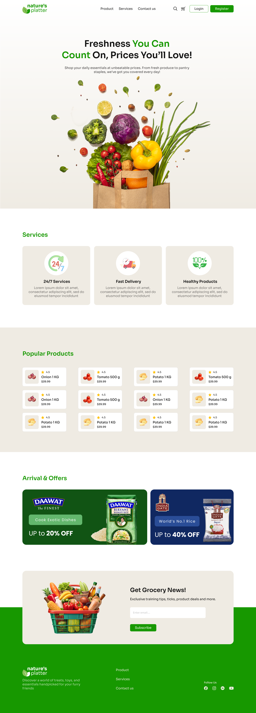
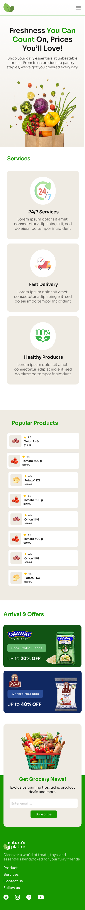

# 🍃 Natures Platter 🍽️

### Welcome to   Sohoz 😎, Sorol 😁 & Simple 🤩 Assignment 02

Hey Future Dev! 🔥  
Your mission is to build an **attractive & Ecommerce Landing Page** for:  🍃 **Natures Platter**🍽️

---

𝐓𝐞𝐜𝐡𝐧𝐨𝐥𝐨𝐠𝐲 𝐒𝐭𝐞𝐜𝐤: HTML,Tailwind CSS

---

𝐅𝐞𝐚𝐭𝐮𝐫𝐞𝐬:Services,Popular Products,Arrival &Offers,Contacts

---

𝐇𝐨𝐰 𝐭𝐨 𝐑𝐮𝐧 𝐓𝐡𝐢𝐬 𝐏𝐫𝐨𝐣𝐞𝐜𝐭 𝐋𝐨𝐜𝐚𝐥𝐥𝐲
Follow these simple steps to download and run this project on your computer.
PrerequisitesBefore you begin, make sure you have VS Code (or any text editor) installed on your computer.
𝐒𝐭𝐞𝐩 𝟏: Download the ProjectYou can get the files on your computer in one of two ways:
Option A (Easy): Click the green Code button at the top right of this GitHub page, then click Download ZIP. Extract the downloaded ZIP file to a folder on your computer.
Option B (Using Git): Open your terminal/command prompt and run the following command:bashgit clone <PASTE_YOUR_REPOSITORY_URL_HERE>
Use code with caution.
𝐒𝐭𝐞𝐩 2: Open the ProjectOpen Visual Studio Code.Go to File > Open Folder and select the extracted project folder.
𝐒𝐭𝐞𝐩 3: Run the ProjectSince this project is built using HTML and Tailwind CSS, you can run it instantly using one of these methods:
Method 1: Install the Live Server extension in VS Code. Once installed, right-click on the index.html file and select Open with Live Server. This will automatically open the project in your browser and refresh whenever you make changes.

--------

𝐏𝐫𝐨𝐣𝐞𝐜𝐭 𝐋𝐢𝐯𝐞 𝐋𝐢𝐧𝐤:https://habiba22akter.github.io/Assignment-2-PH/

--------

## 🖼️ Sample Preview  
<table>
  <tr>
    <th>Destop View</th>
    <th>Mobile View</th>
  </tr>
  <tr>
    <td></td>
    <td></td>
  </tr>
</table>

---

> 💬 *“Any fool can write code that a computer can understand. Good programmers write code that humans can understand.”*    - Martin Fowler 🔥    Chief Scientist at ThoughtWorks
